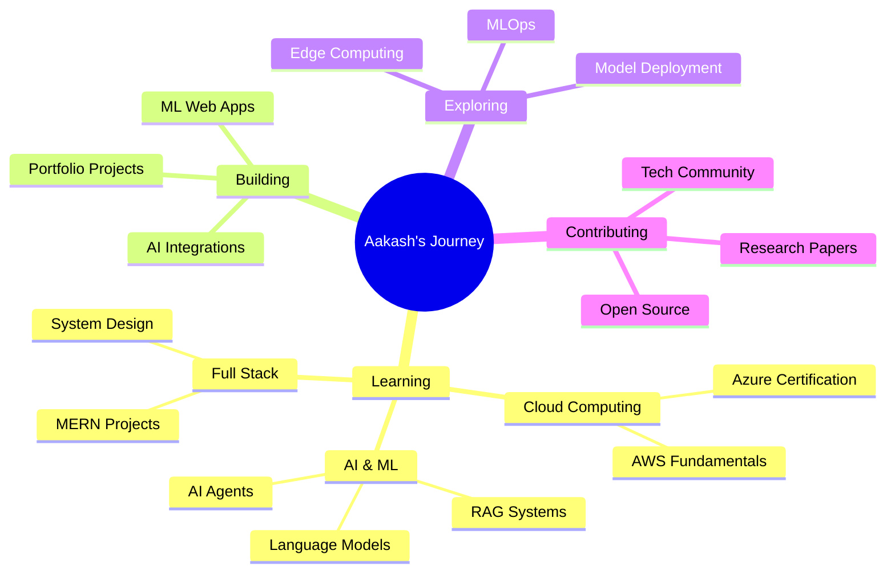

<!--
 █████╗  █████╗ ██╗  ██╗ █████╗ ███████╗██╗  ██╗    ██╗  ██╗██╗   ██╗███████╗██╗  ██╗██╗    ██╗ █████╗ ██╗  ██╗ █████╗ 
██╔══██╗██╔══██╗██║ ██╔╝██╔══██╗██╔════╝██║  ██║    ██║ ██╔╝██║   ██║██╔════╝██║  ██║██║    ██║██╔══██╗██║  ██║██╔══██╗
███████║███████║█████╔╝ ███████║███████╗███████║    █████╔╝ ██║   ██║███████╗███████║██║ █╗ ██║███████║███████║███████║
██╔══██║██╔══██║██╔═██╗ ██╔══██║╚════██║██╔══██║    ██╔═██╗ ██║   ██║╚════██║██╔══██║██║███╗██║██╔══██║██╔══██║██╔══██║
██║  ██║██║  ██║██║  ██╗██║  ██║███████║██║  ██║    ██║  ██╗╚██████╔╝███████║██║  ██║╚███╔███╔╝██║  ██║██║  ██║██║  ██║
╚═╝  ╚═╝╚═╝  ╚═╝╚═╝  ╚═╝╚═╝  ╚═╝╚══════╝╚═╝  ╚═╝    ╚═╝  ╚═╝ ╚═════╝ ╚══════╝╚═╝  ╚═╝ ╚══╝╚══╝ ╚═╝  ╚═╝╚═╝  ╚═╝╚═╝  ╚═╝
                             Computer Science Engineering Student | ML Enthusiast | Full-Stack Developer
-->

<div align="center">


<br/>

<!-- Typing SVG -->
[](https://git.io/typing-svg)

<br/>

<!-- Contact Badges -->
<p align="center">
<a href="mailto:kushwaha.aakash1809@gmail.com">

</a>
<a href="https://linkedin.com/in/aakash-kushwaha">

</a>
<a href="https://leetcode.com/u/Aakash_1809/">

</a>
</p>

<p align="center">


</p>

</div>

---

## 🚀 About Me

```python
class AakashKushwaha:
    def __init__(self):
        self.username = "PotatoPatata1809"
        self.role = "CSE Student & ML Enthusiast"
        self.education = {
            "university": "Manipal University Jaipur",
            "degree": "B.Tech in Computer Science & Engineering",
            "cgpa": "9.49/10",
            "graduation": "August 2026",
            "achievements": ["Dean's List (5/6 semesters)", "ACM Member"]
        }
        
        self.research = {
            "project": "Deepfake Detection using FACTOR Framework",
            "metrics": {
                "accuracy": "91.45%",
                "precision": "95.60%",
                "f1_score": "93.82%",
                "auc": "0.9764"
            },
            "tech_stack": ["PyTorch", "ResNet-18", "OpenCV", "scikit-learn"]
        }
        
        self.currently_learning = [
            "Cloud Computing ☁️",
            "Language Models 🤖",
            "AI Agents 🧠"
        ]
        
        self.experience = {
            "role": "Equity Markets Analyst",
            "company": "Finlatics Financial Market Experience Program",
            "period": "Jun 2025 - Aug 2025"
        }
    
    def say_hi(self):
        print("Thanks for visiting! Let's build something amazing together! 🚀")

me = AakashKushwaha()
me.say_hi()
```

---

## 🎯 Academic Excellence

<div align="center">

### 🏆 Achievements & Recognition

<table>
<tr>
<td align="center" width="33%">

<br/><b>Academic Excellence</b>
</td>
<td align="center" width="33%">

<br/><b>Top Performer</b>
</td>
<td align="center" width="33%">

<br/><b>Professional Society</b>
</td>
</tr>
</table>

### 📚 Relevant Coursework


</div>

---

## 💻 Tech Stack & Skills

<div align="center">

### Programming Languages
<p>

</p>

### Frontend Development
<p>

</p>

### Backend & Database
<p>

</p>

### Machine Learning & AI
<p>

<br/>


</p>

### Tools & Technologies
<p>

</p>

### Currently Learning
<p>


</p>

</div>

---

## 🔬 Featured Research Project

<div align="center">

### 🎭 Deepfake Detection using FACTOR Framework


</div>

**Research Highlights:**
- 🎯 Developed a novel **similarity-based verification** approach for deepfake detection
- 📊 Achieved **91.45% accuracy** with **95.60% precision** on benchmark datasets
- 🔬 Tested on **518 video samples** across UADFV, FakeAVCeleb, Celeb-DF, and DFDC
- 🧠 Implemented **ResNet-18** for feature extraction with cosine similarity matching
- 📈 **93.82% F1-score** and **0.9764 AUC** demonstrating superior robustness

**Technical Stack:**
```python
framework = {
    "deep_learning": ["PyTorch", "ResNet-18"],
    "computer_vision": ["OpenCV", "Face Alignment"],
    "ml_tools": ["scikit-learn", "NumPy", "Pandas"],
    "visualization": ["Matplotlib", "Confusion Matrix", "Similarity Distributions"],
    "techniques": ["Cosine Similarity", "Adaptive Thresholding", "Feature Extraction"]
}
```

**Key Innovations:**
- ✨ Similarity-based verification instead of direct classification
- 🎯 Adaptive thresholding for improved accuracy
- 📊 Comprehensive performance comparison with MesoNet baseline
- 🔍 Interpretable results through visualization techniques

---

## 🚀 Repository Showcase

<div align="center">

<table>
<tr>
<td width="50%" valign="top">

### 🎭 [sentiment-analysis-webapp-sagemaker](https://github.com/PotatoPatata1809/sentiment-analysis-webapp-sagemaker)


**Interactive application built for continuous learning**

Full-stack sentiment analysis web application integrating machine learning models with interactive UI. Demonstrates NLP techniques and cloud deployment using AWS SageMaker.

🔧 **Tech Stack:** Python, Flask/React, AWS SageMaker, NLP
📝 **Focus:** Machine Learning, Cloud Deployment, Web Integration

</td>
<td width="50%" valign="top">

### 🏦 [bankingsystem](https://github.com/PotatoPatata1809/bankingsystem)


**Practice repository for exploring advanced features**

Banking system implementation showcasing object-oriented programming principles, database integration, and transaction management.

🔧 **Tech Stack:** Java, MySQL
📝 **Features:** CRUD Operations, Database Integration

</td>
</tr>

<tr>
<td width="50%" valign="top">

### 👤 [face_recognition](https://github.com/PotatoPatata1809/face_recognition)


**Full-featured application built as a learning exercise**

Computer vision application implementing face recognition using modern ML techniques. Hands-on learning with OpenCV and deep learning frameworks.

🔧 **Tech Stack:** Python, OpenCV, ML Libraries
📝 **Features:** Face Detection, Recognition, Real-time Processing

</td>
<td width="50%" valign="top">

</td>
</tr>
</table>

</div>

---

## 💼 Professional Experience

<div align="center">

### 📈 Equity Markets Analyst
**Finlatics Financial Market Experience Program** | *Remote*  
*June 2025 - August 2025*

</div>

**Key Responsibilities & Achievements:**
- 💼 Managed virtual equity portfolio with **FinScore of 50**, benchmarking against BSE 500 index
- 📊 Conducted comprehensive stock analysis using technical indicators, market news, and fundamentals
- 🎯 Focused on high-performing sectors: **Banking, Technology, Real Estate**
- 📈 Selected and tracked strategic stocks: **SBI, Emami Ltd., Suzlon** for consistent returns
- 💡 Applied **quantitative analysis** and **risk management** strategies

---

## 📜 Certifications & Learning

<div align="center">

### 🎓 Ongoing Certifications

<table>
<tr>
<td align="center" width="50%">

<br/><b>Expected: December 2025</b>
</td>
<td align="center" width="50%">

<br/><b>Expected: November 2025</b>
</td>
</tr>
</table>

### ✅ Completed Certifications

 • Aug 2025  
 • May 2024  
 • Mar 2024  
 • Feb 2024  
 • Jan 2024

</div>

---

## 📊 GitHub Statistics

<div align="center">


<br/><br/>


<br/><br/>

### 🏆 GitHub Trophies


</div>

---

## 🎯 Current Focus & Goals

<div align="center">



</div>

**2025 Goals:**
- 🎓 Complete **Azure Cloud Certification**
- 🤖 Build **3 AI Agent projects** with LangChain
- 🚀 Deploy **5 full-stack MERN applications**
- 📝 Contribute to **open-source ML projects**
- 🏆 Participate in **ML competitions** (Kaggle)
- 📚 Publish **research findings** on deepfake detection

---

## 🌱 What I'm Currently Working On

- 🔭 Exploring **AI Agents** and **Language Models** for intelligent systems
- 🌐 Building full-stack applications with **MERN stack**
- ☁️ Learning **Cloud Computing** (Azure, AWS)
- 🤖 Implementing **ML models** in production environments
- 📊 Advancing **Computer Vision** and **Deep Learning** skills
- 🧠 Studying **System Design** and **Software Architecture**

---

## 💡 Skills Matrix

<div align="center">

| Category | Technologies | Proficiency |
|----------|-------------|-------------|
| **Programming** | C, Java, Python, JavaScript | ⭐⭐⭐⭐⭐ |
| **Frontend** | React.js, Next.js, HTML/CSS | ⭐⭐⭐⭐ |
| **Backend** | Node.js, Express, MySQL | ⭐⭐⭐⭐ |
| **Machine Learning** | PyTorch, TensorFlow, scikit-learn | ⭐⭐⭐⭐ |
| **Computer Vision** | OpenCV, ResNet, Image Processing | ⭐⭐⭐⭐⭐ |
| **Cloud** | Azure (Learning), AWS (Basics) | ⭐⭐⭐ |
| **Database** | MySQL, MongoDB | ⭐⭐⭐⭐ |
| **Tools** | Git, Jupyter, VS Code, Linux | ⭐⭐⭐⭐ |

</div>

---

## 🤝 Let's Connect!

<div align="center">

I'm always excited to collaborate on interesting projects, especially in:
- 🤖 **Machine Learning & AI**
- 🌐 **Full-Stack Development**
- 👁️ **Computer Vision**
- 📊 **Data Science**

**Feel free to reach out!**

[](mailto:kushwaha.aakash1809@gmail.com)
[](https://linkedin.com/in/aakash-kushwaha)
[](https://leetcode.com/u/Aakash_1809/)
[](https://github.com/PotatoPatata1809)

<br/>

### 💭 Quote of the Day


<br/>

### 📈 Profile Views


</div>

---

<div align="center">


### 🌟 "Turning code into intelligence, one algorithm at a time!" 🌟

**Made with ❤️ by Aakash Kushwaha**

⭐ *If you find my work interesting, consider giving my repositories a star!*

</div>
